#task2
##usage
1. to test this program with the online API, please use the following command:
```
gradle run --args="online"
```
2. to test this program with the offline API, please use the following command:
```
gradle run --args="offline"
```
notice the online version and offline version are using the similar GUI but they might look a little bit different.
##how to use
###online version
when you typed in the the above command, the program should show this interface.
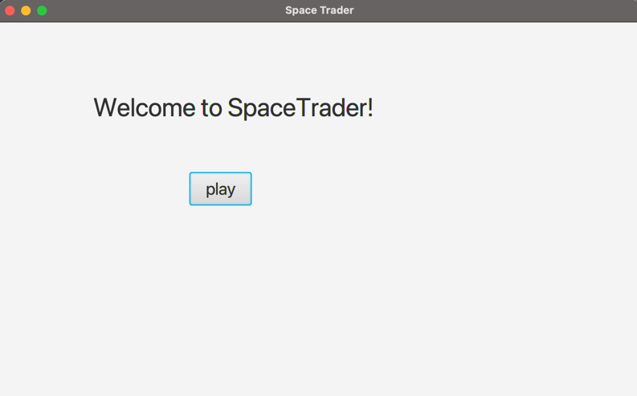
click play to connect with the online API.
if unfortunately the server is down or you are not connect to internet, it will go to an error page.
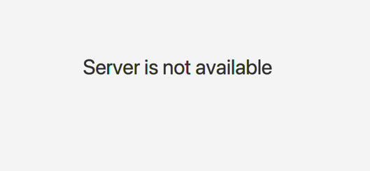
otherwise, it will go to the login page.
if you already have a token, then you can type token in the first text field. if you do not have a token yet, you can type the whatever username you want in the seconde text field. Both of them will bring you to the account info page.
if the username has been signed up before, there will be a error message.
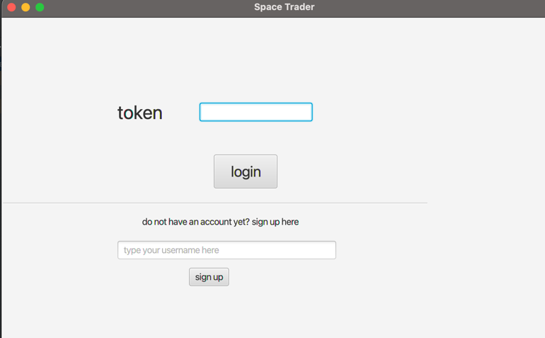
After you get in the information page, you should see the basic information of your account.
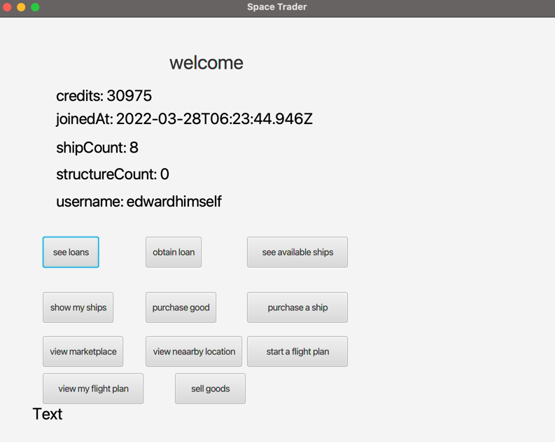
There are some functional buttons, click see loans button to see the available loans in the system. click obtain loan button to jump to the search page, type in the type of loan you want to obtain here and click the button.

click see available ships to see the available ships in the system. type the type of ship you want to search here and click the button.
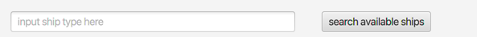
click show my ships button to see your ships.
click purchase good button and type in the shipId, good you want to buy and quantity, then click buy goods button to buy.
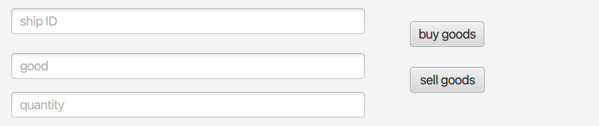
click purchase a ship button. type in the location you want to buy a ship and the ship class to buy. click the button.
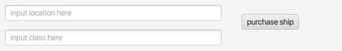
click view marketplace button. type in the location and click button to view a marketplace.
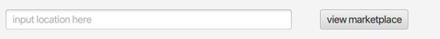
click view nearby location button. type in the location and click button to view the nearby locations.
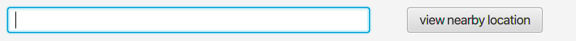
click start a flight plan. type in the shipId and location to create a flight plan. click the button.
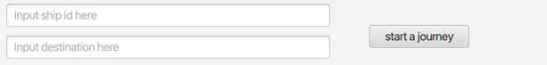
click sell goods and type in the shipId, good you want to sell and quantity in the same text field as the purchase goods, then click sell goods button to sell.
###offline version
when you typed in the the above command, the program should show this interface.
click play to jump to the login page.
you can login or sign up here.
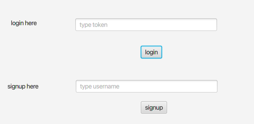

it doesn't matter what you type in the text field, a random token or username should bring you to the account info page.

this is the info page. try to click every button to see the different functionalities. view marketplace, create flight plan, purchase goods and sell goods need to input the prompt information.

